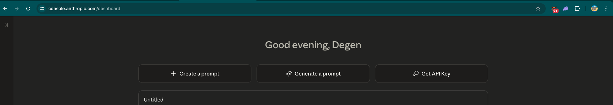
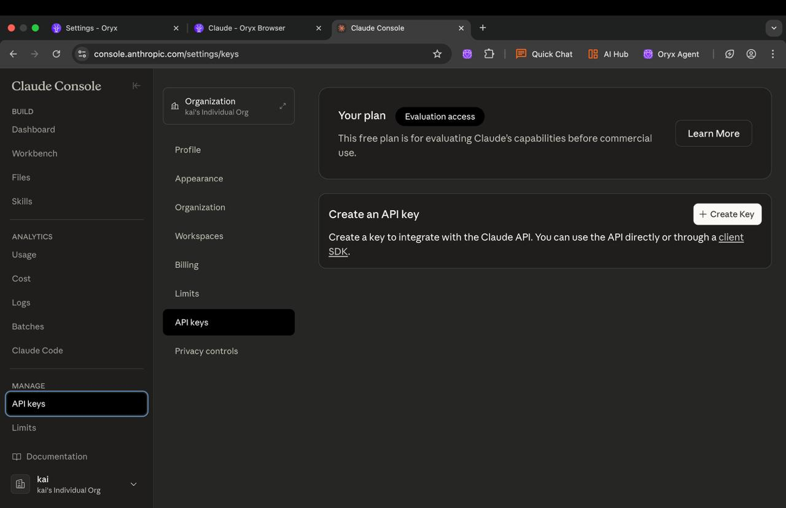

Claude Sonnet 3.7 and 4.0 are excellent for agent tasks. Great for complex reasoning and following instructions precisely.

## Get your API key

### Step 1: Go to Claude Console

Visit [console.anthropic.com](https://console.anthropic.com/dashboard) and click **API keys** in the left sidebar.

### Step 2: Create a key

Click **Create Key**, name it, and click **Create Key** again. Copy the key that appears.

## Configure Oryx

Click the settings icon in Oryx, then click **USE** on the Claude card. Paste your API key and set your model. For Claude Sonnet 4.0, use model ID `claude-opus-4-20250514`, set **Context Window Size** to `128000`, and check **Supports Images**. Click **Save**.

Done! You're ready to use Oryx with Claude.
