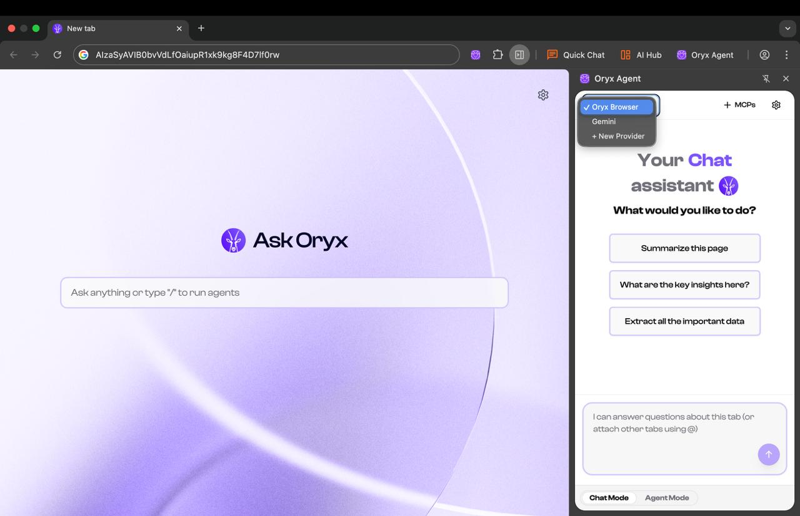

To unlock Oryx's full potential, you need to configure an AI provider. You have two options:

1. **Use models locally** - Run AI on your machine for complete privacy
2. **Bring your own API keys** - Use cloud providers like ChatGPT, Gemini, or Claude

Visit `chrome://settings/oryx` to configure your AI provider.

<Note>
  **Our recommendation:** Oryx works best with **Gemini 2.5 Flash**. We highly
  recommend getting an API key from Google AI Studio for Gemini 2.5 Flash.
  **Google AI Studio gives free access to Gemini 2.5 Flash models for up to 20
  requests per minute** - perfect for getting started without any costs.
</Note>

## Why bring your own API keys or use local models?

<AccordionGroup>
  <Accordion title="🔒 Privacy - You control your data">
    Your API keys are stored locally and encrypted. Requests go directly from
    your browser to the provider - Oryx servers never see your data or keys.
    With local models, your data never even leaves your machine.
  </Accordion>
  <Accordion title="⚡ No limits - Use Oryx freely">
    Oryx has rate limits on the default shared models. For the smoothest
    experience without interruptions, bring your own API keys or run models
    locally. Command Oryx as much as you want without hitting limits.
  </Accordion>
  <Accordion title="🚀 Premium features - Unlock advanced automation">
    $Oryx token holders get access to premium automation tiers, advanced MCP
    servers, and priority processing. Own the token, own the experience.
  </Accordion>
</AccordionGroup>

## Option 1: Bring your own keys to ChatGPT, Gemini, Claude! (Recommended)

Connect to powerful cloud models using your own API keys. Oryx works exceptionally well with Gemini 2.5 Flash for trading commands, contract analysis, and agentic workflows.

### Available Cloud Providers

<CardGroup cols={4}>
  <Card title="Gemini (free)" href="/bring-your-own-keys/gemini">
    Use Gemini-2.5-flash! Recommended.
  </Card>
  <Card title="Claude" href="/bring-your-own-keys/claude">
    Use Claude sonnet-3.7 or sonnet-4.0!
  </Card>
  <Card title="OpenAI" href="/bring-your-own-keys/openai">
    Use GPT-4.1 for best results!
  </Card>
  <Card title="Open Router" href="/bring-your-own-keys/openrouter">
    Access multiple AI models through one API!
  </Card>
</CardGroup>

## Option 2: Using local AI LLM models

Running models locally gives you complete control and privacy. Your data stays on your machine, and there are no usage costs or API limits.

<Warning>
  NOTE: Local LLMs are great for "Chat Mode" tasks. For "Agent Mode" and "Teach
  Mode", our recommendation is to use bigger cloud based LLMs like ChatGPT,
  Gemini or Claude.
</Warning>

### Available Local Options

<CardGroup cols={3}>
  <Card title="Ollama" icon="robot" href="/local-LLMs/ollama">
    Popular tool for running open-source models locally with easy model
    management
  </Card>
  <Card title="LM Studio" icon="desktop" href="/local-LLMs/lm-studio">
    User-friendly GUI for downloading and managing local language models
  </Card>
  <Card title="GPT-OSS" icon="brain" href="/local-LLMs/gpt-oss">
    OpenAI's open-source GPT model optimized for local execution
  </Card>
</CardGroup>

### Recommended Models

For best results with local models:

- **gpt-oss:20B** - Great balance of speed and capability
- **qwen3:8B** or **qwen3:14B** - Fast and good for chat-mode, but struggles with agentic tasks

<Warning>
  Many models like Deepseek-R1 via Ollama don't support tool calls and you'll
  get `400` errors when trying to use them with Oryx. Stick with the recommended
  models above for the best experience.
</Warning>

## Switching Between Models

Use the switcher to change between different LLM providers.

- Use local models for sensitive work data
- Switch to cloud models for agentic tasks.

<Card title="Get $ORYX Token" icon="coins" href="/token">
  Unlock premium automation tiers, advanced features, and governance rights
</Card>

## Next Steps

Once you've configured your AI provider, start commanding Oryx:

- Use **natural language commands** for trading, research, and automation
- Try **split-view AI** to analyze contracts and whitepapers side-by-side
- Build **custom agents** to automate repetitive DeFi tasks
- Connect **MCP servers** to integrate your work tools
